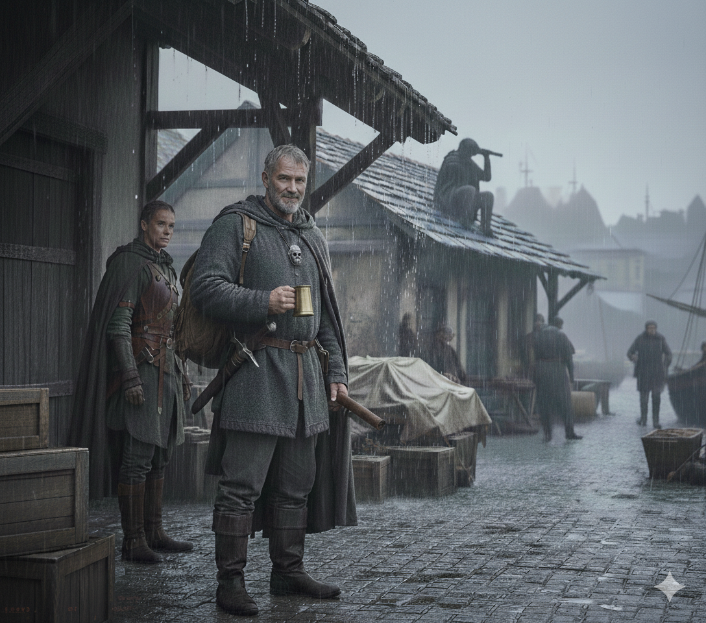

### Kaelen el Enviado del Rey Gorila

#### **Nombre:** **Kaelen "Manos de Piedra"**

#### **Quién es:**
Kaelen no es un noble ni un diplomático de corte. Es un veterano curtido, el **"Primer Explorador"** del Rey Gorila. Su título oficial es Jefe de la Vanguardia de Krit, pero en la práctica, es el líder de los *rangers* y espías que operan en las peligrosas fronteras de la isla. Se ganó su apodo "Manos de Piedra" por su habilidad para escalar los acantilados más traicioneros de Krit sin cuerda y por su reputación de ser inquebrantable bajo presión.

#### **Trasfondo:**
Nacido y criado en las comunidades pesqueras de Krit, Kaelen vio de primera mano la dureza de la vida y el liderazgo pragmático del Rey Gorila. No lucha por gloria, sino por la supervivencia de su gente. Ha pasado décadas cartografiando los mares del sur y conoce los rumores y peligros de la región mejor que nadie. El rey confía en él no por su linaje, sino por su lealtad probada y su crudo realismo. Fue él quien organizó la red de espías que ahora vigila los movimientos de Medusa y fue él quien identificó a los aventureros como la "apuesta más improbable pero necesaria" para tener una oportunidad contra la hechicera.

#### **Apariencia y Vestimenta:**
* **Físico:** Es un hombre de unos 50 años, con un físico compacto y musculoso, forjado por una vida de remar, escalar y luchar. Tiene el rostro curtido por el sol y el viento salado, con profundas arrugas alrededor de sus ojos. Su cabello es una mata de color gris acero, corto y práctico, y luce una barba trenzada al estilo de los marineros de Krit.
* **Vestimenta:** No usa ropas de corte. Viste de forma funcional y discreta para no llamar la atención en un puerto lleno de chusma. Lleva pantalones de lona encerada, botas altas de cuero de foca y una túnica de lana gruesa de color gris oscuro. Sobre ella, una capa de viaje con capucha, raída y manchada de sal, perfecta para camuflarse en las sombras de los muelles. Lo único que delata su rango es un pequeño broche de plata con forma de gorila que sujeta su capa, el emblema personal del rey.
* **Equipo:** No lleva armadura pesada. Confía en una cota de malla ligera y bien aceitada que lleva bajo la túnica. A su cinturón cuelgan un hacha de mano de aspecto funcional y una daga larga. Lleva una mochila de cuero con equipo de supervivencia, mapas y una bolsa de dinero sorprendentemente pesada.

#### **Personalidad y Manera de Hablar:**
* **Directo y sin rodeos:** No pierde el tiempo con formalidades. Va directo al grano.
* **Observador y Cauteloso:** Antes de acercarse a los héroes, los habrá estado observando durante al menos un día, evaluando sus fortalezas, debilidades y su dinámica como grupo.
* **Pragmático, no idealista:** No les hablará de honor ni de gloria. Les hablará de supervivencia, de tácticas y del coste de la guerra. Respeta la fuerza y el ingenio por encima de los títulos.
* **Lealtad Férrea:** Su lealtad al Rey Gorila y a la gente de Krit es absoluta. Verá a los aventureros como herramientas —herramientas muy capaces y valiosas, pero herramientas al fin y al cabo— para asegurar la supervivencia de su hogar.
* **Voz:** Habla con una voz grave y tranquila, acostumbrada a no ser oída por el enemigo. Nunca levanta la voz, pero cada palabra tiene peso.

#### **Con quién anda:**
No viaja con un séquito llamativo. Lo acompañan dos personas que parecen simples marineros o mercenarios, pero que en realidad son su guardia de élite, los **"Vigías Silenciosos"** de Krit. Son hombres y mujeres de pocas palabras, expertos en el combate en espacios cerrados y en desaparecer entre la multitud. Mientras Kaelen habla con los héroes, sus dos acompañantes estarán vigilando el entorno, uno cerca y otro desde un tejado o un callejón cercano, asegurándose de que la conversación no sea interrumpida ni espiada.

#### **Cómo se acerca a los Héroes:**
No los citará en un lugar oficial. Se les acercará en un momento en que estén frustrados y en una situación vulnerable, por ejemplo:
* Justo después de que el Gremio de Carpinteros se niegue a ayudarlos.
* En una taberna de mala muerte, mientras discuten sobre cómo conseguir los suministros.

Kaelen se sentará en su mesa sin ser invitado, con una jarra de cerveza en la mano, y dirá algo como:
> *"He oído que buscan suministros para un viaje al sur. Y he oído que la Compañía del Kraken Negro les está haciendo la vida imposible. Mi señor y yo tenemos un interés común en que ese 'Kraken' se ahogue. Quizás podamos ayudarnos mutuamente."*